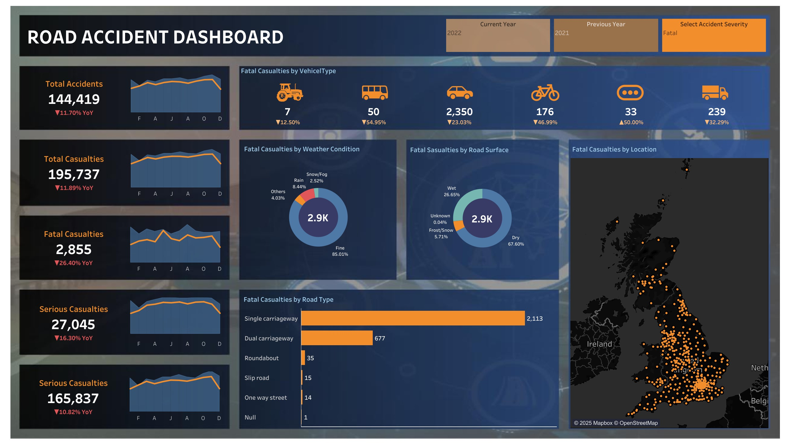

# 🚦 Road Accident Dashboard (Tableau Project)

An interactive Tableau dashboard analyzing UK road accident statistics with dynamic filters and detailed visual breakdowns.

---

---

## 📊 Project Overview

- **Tool Used:** Tableau
- **Project Type:** Data Visualization Dashboard
- **Objective:** Visualize and analyze UK road accident trends, casualties, and contributing factors using interactive visual elements.

---

## 📁 Project Structure

| File Name                         | Description                                      |
| --------------------------------- | ------------------------------------------------ |
| `RoadAccident.twbx`    | Tableau packaged workbook (main dashboard file)  |
| `Dashboard.pdf`     | PDF version of the dashboard                     |
| `accidentData.csv`       | Raw dataset used for analysis                    |
| `Dashboard.png`                 | Screenshot image of the dashboard                |
| `README.md`                       | Project documentation (this file)                |

---

## 🚀 How to Use

Open Dashboard:

Use Tableau Desktop or Tableau Public

Open the file: Road_Accident_Dashboard.twbx
